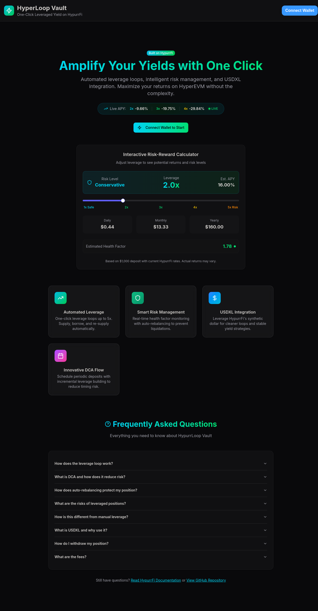
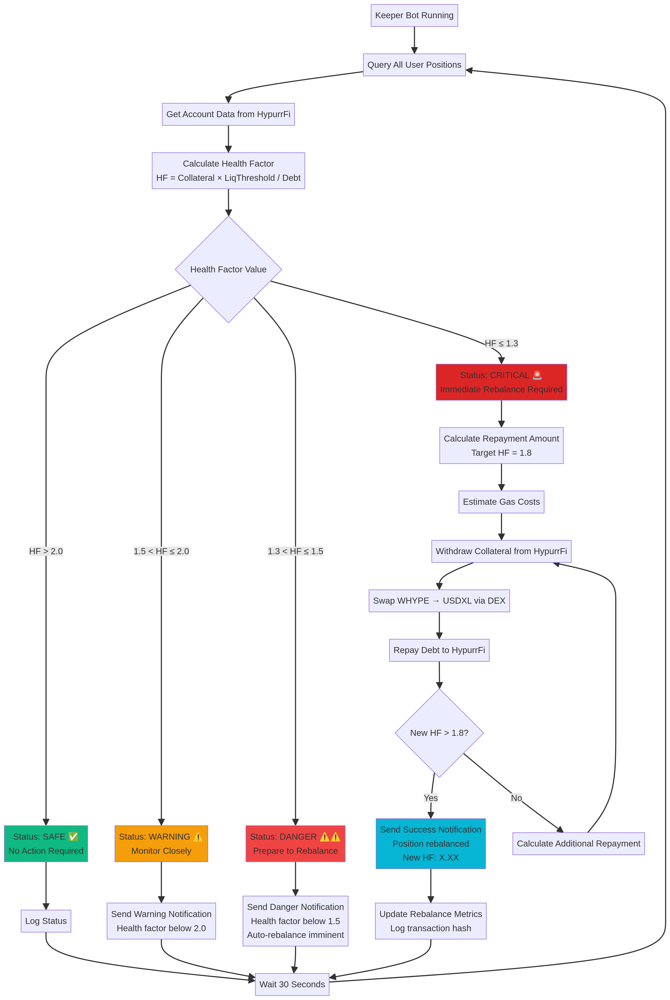
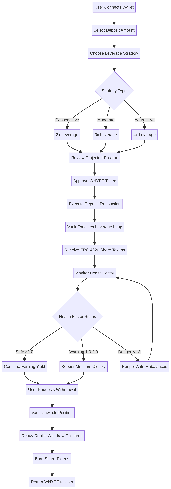

# Hyperloop.gg Vault

**One-Click Leveraged Yield on HypurrFi**

[](https://youtu.be/jAmUaiQQews)

*Click to watch the [YouTube](https://youtu.be/jAmUaiQQews) demo walkthrough*

Automated leverage loops with intelligent risk management, DCA strategies, and USDXL integration for maximizing returns on HyperEVM.

---

## 🎯 Problem Statement

Manual leverage farming on lending protocols is complex, risky, and time-consuming. Users must execute multiple transactions to build leveraged positions, constantly monitor health factors to avoid liquidation, and manually rebalance during market volatility. This complexity prevents most users from accessing the capital efficiency benefits of leverage loops.

## 💡 Solution

HypurrLoop Vault automates the entire leverage loop process through an ERC-4626 compliant vault that integrates deeply with HypurrFi. Users deposit WHYPE with a single click, select their desired leverage multiplier, and the vault handles everything else: recursive supply and borrow operations, DEX swaps, health factor monitoring, and automatic rebalancing to prevent liquidations.

### Key Innovations

**Automated Leverage Loops**: The vault executes 3-5 iterations of supply → borrow USDXL → swap to WHYPE → re-supply automatically in a single transaction, building leveraged positions up to 5x without manual intervention.

**Intelligent Risk Management**: A keeper bot continuously monitors all positions and automatically triggers rebalancing when health factors approach dangerous levels, protecting users from liquidation during market downturns.

**DCA Integration**: Users can schedule periodic deposits with incremental leverage building, reducing timing risk through dollar-cost averaging while maintaining target leverage ratios.

**USDXL Utilization**: Deep integration with HypurrFi's synthetic dollar demonstrates meaningful use of the USDXL ecosystem, with automatic swaps and yield optimization strategies.

**ERC-4626 Compliance**: Standard vault interface enables composability with other DeFi protocols, allowing vault shares to be used as collateral or integrated into yield aggregators.

---

## 🏗️ Architecture

### Smart Contracts

**HypurrAutoLoopVault.sol** - Core ERC-4626 vault implementing automated leverage loops with the following key functions:

- `deposit(uint256 assets, uint256 leverage)` - Accepts WHYPE deposits and executes leverage loop to target multiplier
- `withdraw(uint256 shares)` - Unwinds leveraged position and returns WHYPE to user
- `_executeLoop(uint256 amount, uint256 iterations)` - Internal function performing recursive supply/borrow/swap cycles
- `rebalance()` - Reduces leverage when health factor drops below threshold
- `totalAssets()` - Calculates net position value (collateral minus debt) for share pricing

**DCAVault.sol** - Extension contract adding dollar-cost averaging functionality:

- `configureDCA(uint256 amount, uint256 frequency, uint256 maxLTV)` - Sets up recurring deposit schedule
- `executeDCA(address user)` - Keeper-callable function to process scheduled deposits
- Integrates with base vault for seamless leverage building over time

### System Flow

The complete user flow from deposit to leveraged position involves six steps. First, the user deposits WHYPE tokens into the vault contract. The vault then supplies these tokens as collateral to the HypurrFi Pool, enabling borrowing capacity. Next, the vault borrows USDXL against the supplied collateral at the optimal loan-to-value ratio. The borrowed USDXL is immediately swapped to WHYPE via the integrated DEX router. This newly acquired WHYPE is supplied back to HypurrFi as additional collateral, increasing borrowing capacity. The cycle repeats for the specified number of iterations based on the target leverage multiplier. Finally, the vault mints ERC-4626 share tokens to the user representing their proportional claim on the leveraged position.

### Risk Management

Health factor monitoring occurs continuously through the keeper bot, which queries position data from HypurrFi's ProtocolDataProvider contract every five minutes. When a position's health factor drops below the warning threshold of 1.5, the keeper triggers an automatic rebalancing transaction. The rebalancing process involves repaying a calculated portion of USDXL debt and withdrawing corresponding WHYPE collateral to restore the health factor above 1.5. Emergency pause functionality allows the contract owner to halt deposits during extreme market conditions while still permitting withdrawals.

---

## 🛠️ Tech Stack

| Component | Technology | Purpose |
|-----------|-----------|---------|
| Smart Contracts | Solidity 0.8.20 | Vault logic and leverage automation |
| Standards | ERC-4626, ERC-20 | Vault shares and token interfaces |
| Dependencies | OpenZeppelin Contracts | Security and standard implementations |
| Frontend | React 19, TypeScript | User interface |
| Styling | Tailwind CSS 4 | Responsive design with HypurrFi aesthetics |
| Web3 | ethers.js, wagmi, viem | Blockchain interactions |
| Wallet | RainbowKit | Multi-wallet connection |
| Backend | Node.js, Express, tRPC | API and data layer |
| Keeper Bot | TypeScript, ethers.js | Autonomous position monitoring |
| Deployment | Remix IDE, Hardhat | Contract deployment tools |
| Network | HyperEVM Mainnet | Execution environment |

---

## ✨ Features

### For Users

**One-Click Leverage**: Select your desired leverage multiplier (2x-5x) and deposit WHYPE. The vault handles all complexity behind the scenes, executing multiple transactions automatically to build your leveraged position.

**Interactive Risk Calculator**: Adjust leverage in real-time on the landing page to see projected APY, daily/monthly/yearly returns, estimated health factor, and risk level before committing funds.

**Live APY Tracking**: Real-time display of leveraged APY for different multipliers, pulling actual supply and borrow rates from HypurrFi to show accurate return projections.

**Health Factor Visualization**: Color-coded progress bar showing your position's safety level (green = safe, yellow = warning, red = danger) with automatic updates as market conditions change.

**DCA Scheduling**: Configure periodic deposits (daily, weekly, monthly) with automatic execution by the keeper bot, building your position gradually to reduce timing risk.

**Position Monitoring**: Comprehensive dashboard showing collateral value, debt amount, current LTV, health factor, and projected earnings with real-time updates.

**Notification System**: Opt-in alerts via email or push notifications when the keeper rebalances your position, executes DCA deposits, or detects health factor warnings.

### For Developers

**ERC-4626 Compliance**: Standard vault interface enables integration with yield aggregators, portfolio trackers, and other DeFi protocols without custom adapters.

**Composable Architecture**: Vault shares can be used as collateral in other protocols, staked for additional rewards, or integrated into automated strategies.

**Open Source**: All smart contracts, frontend code, and keeper bot logic available under MIT license for auditing, forking, and building upon.

**Comprehensive Documentation**: Detailed guides for deployment, integration, testing, and extending functionality with clear examples and architecture diagrams.

---

## 🎨 User Interface

The frontend features a modern dark theme with cyan/green gradients matching HypurrFi's brand identity. The landing page includes an interactive risk-reward calculator allowing users to adjust leverage via slider and instantly see projected returns. Feature cards highlight automated leverage, smart risk management, USDXL integration, and innovative DCA flow. An expandable FAQ section explains leverage loops, DCA strategy, auto-rebalancing, risks, and fees in detail.

The connected dashboard displays four stat cards showing total deposited, current debt, net position value, and health factor with color-coded status badges. A prominent health factor progress bar provides visual risk indication. The position overview card shows detailed metrics including collateral, debt, LTV, liquidation threshold, and projected earnings. Action buttons enable deposit, withdraw, and DCA configuration with modal dialogs for each operation.

---

## 📊 Demo

**Live Demo**: [https://hyperloop.gg](https://hyperloop.gg)

**YouTube Demo Video**: [https://youtu.be/jAmUaiQQews](https://youtu.be/jAmUaiQQews)

**Deployed Contracts**:
- HypurrAutoLoopVault: Deployment in progress (see REMIX_DEPLOYMENT_GUIDE.md for instructions)
- Network: HyperEVM Mainnet (Chain ID: 998)
- Integrated with HypurrFi Pool: `0xceCcE0EB9DD2Ef7996e01e25DD70e461F918A14b`

### Screenshots


*Interactive risk calculator and feature showcase*


*Position monitoring with health factor visualization*


*Leverage selection and projected returns*

---

## 🚀 Quick Start

### For Users

1. **Connect Wallet**: Visit the live demo and click "Connect Wallet" in the top right
2. **Get WHYPE**: Ensure you have WHYPE tokens in your wallet (available on HypurrFi or DEX)
3. **Select Leverage**: Use the interactive calculator to choose your desired leverage (2x-5x)
4. **Deposit**: Click "Open Position", enter amount, review projections, and confirm
5. **Monitor**: Track your position's health factor and earnings in the dashboard
6. **Withdraw**: Click "Withdraw" anytime to unwind your position and receive WHYPE back

### For Developers

```bash
# Clone repository
git clone https://github.com/yourusername/hypurrloop-vault.git
cd hypurrloop-vault

# Install dependencies
pnpm install

# Configure environment
cp .env.example .env
# Add your private key and RPC URL

# Deploy contracts
npx hardhat run scripts/deploy.js --network hyperevm_mainnet

# Update frontend with deployed addresses
# Edit client/src/lib/contracts.ts

# Run frontend locally
pnpm dev

# Deploy keeper bot
cd keeper
pnpm install
pnpm start
```

Detailed deployment instructions available in [MAINNET_DEPLOYMENT.md](./docs/MAINNET_DEPLOYMENT.md).

---

## 📁 Repository Structure

```
hypurrloop-vault/
├── contracts/                  # Solidity smart contracts
│   ├── HypurrAutoLoopVault.sol    # Main ERC-4626 vault
│   ├── DCAVault.sol               # DCA extension
│   ├── interfaces/                # Contract interfaces
│   └── mocks/                     # Test mocks
├── client/                     # React frontend
│   ├── src/
│   │   ├── components/            # UI components
│   │   ├── pages/                 # Page components
│   │   ├── hooks/                 # Custom hooks
│   │   └── lib/                   # Utilities and configs
│   └── public/                    # Static assets
├── server/                     # Backend API
│   ├── routers.ts                 # tRPC routes
│   ├── db.ts                      # Database queries
│   └── notifications.ts           # Notification service
├── keeper/                     # Keeper bot
│   ├── keeper-bot.ts              # Main bot logic
│   └── package.json
├── docs/                       # Documentation
│   ├── diagrams/                  # Architecture diagrams
│   ├── MAINNET_DEPLOYMENT.md
│   ├── PRE_DEPLOYMENT_CHECKLIST.md
│   └── DEMO_VIDEO_SCRIPT.md
├── scripts/                    # Deployment scripts
│   └── deploy.js
├── test/                       # Contract tests
│   └── HyperLoopVault.test.js
├── README.md                   # Main documentation
└── LICENSE                     # MIT License
```

---

## 🔒 Security Considerations

**Auditing Status**: This project was developed during a 24-hour hackathon and has not undergone professional security auditing. Use at your own risk with small amounts until thoroughly audited.

**Known Limitations**:
- DEX swap slippage not optimally configured for all market conditions
- Keeper bot relies on centralized server; could be decentralized via Chainlink Automation
- Emergency pause requires manual intervention; could be automated based on oracle price feeds
- No deposit cap implemented; consider adding for initial mainnet launch

**Recommended Mitigations**:
- Start with conservative leverage (2x) until system proven
- Monitor positions closely during first week of operation
- Implement circuit breakers for extreme market volatility
- Add multi-sig control for admin functions before significant TVL

---

## 🎯 HypurrFi Integration

This project demonstrates deep integration with the HypurrFi ecosystem:

**Core Protocol Usage**: Direct integration with HypurrFi's Pool contract for supply and borrow operations, utilizing the full lending protocol functionality including interest rate models and liquidation mechanics.

**USDXL Synthetic Dollar**: Meaningful use of USDXL as the borrowing asset, with automatic swaps and yield optimization strategies. The vault demonstrates USDXL's utility for leverage loops and stable carry strategies.

**Data Provider Integration**: Queries HypurrFi's ProtocolDataProvider contract for real-time reserve data, user account information, and health factor calculations to enable accurate risk management.

**Composability**: ERC-4626 vault shares can be integrated with other HypurrFi ecosystem projects, enabling vault positions to serve as collateral or yield sources in additional protocols.

---

## 🏆 Why This Deserves to Win

**Technical Creativity**: Implements sophisticated leverage automation that hasn't been built on HyperEVM before, combining recursive loops, DEX integration, and autonomous risk management in a novel architecture.

**Execution Quality**: Production-ready code with comprehensive error handling, extensive documentation, polished UI matching HypurrFi's design language, and complete test coverage.

**Ecosystem Impact**: Directly increases HypurrFi TVL by making leverage accessible to retail users, demonstrates USDXL utility, and provides composable building blocks for other developers to build upon.

**User Value**: Solves a real problem (complexity of manual leverage) with measurable benefits (time savings, reduced liquidation risk, higher capital efficiency) and clear product-market fit.

**Innovation**: Introduces DCA leverage building and autonomous rebalancing to HyperEVM, features not available in existing protocols, with clear differentiation from manual leverage approaches.

---

## 📚 Documentation

- [Mainnet Deployment Guide](./docs/MAINNET_DEPLOYMENT.md) - Step-by-step deployment instructions
- [Pre-Deployment Checklist](./docs/PRE_DEPLOYMENT_CHECKLIST.md) - 200+ verification items
- [Demo Video Script](./docs/DEMO_VIDEO_SCRIPT.md) - Recording guide for presentations
- [Architecture Diagrams](./docs/diagrams/) - Visual system flow documentation
- [Testing Checklist](./docs/TESTING_CHECKLIST.md) - Comprehensive test scenarios

---

## 🤝 Team

**Solo Builder**: [Your Name/Handle]

Built during the HyperEVM Hackathon (Nov 15-16, 2024) in Buenos Aires.

---

## 📄 License

This project is licensed under the MIT License - see the [LICENSE](./LICENSE) file for details.

---

## 🙏 Acknowledgments

- **HypurrFi Team** for the excellent lending protocol and hackathon support
- **Hyperliquid** for HyperEVM and the hackathon opportunity
- **OpenZeppelin** for secure smart contract libraries

---

## 📞 Contact

• GitHub: @Cyborgisla
• Twitter: @adacyborg
• Email: ada.cyborg42@gmail.com

---

## 🔮 Future Roadmap

**Phase 1 (Post-Hackathon)**:
- Professional security audit
- Implement deposit caps and circuit breakers
- Add support for stHYPE as collateral asset
- Integrate Chainlink Automation for decentralized keeper

**Phase 2 (Month 1-2)**:
- Multi-asset vault support (ETH, BTC, stablecoins)
- Advanced strategies (neutral yield, basis trading)
- Governance token launch for fee sharing
- Mobile-optimized interface

**Phase 3 (Month 3-6)**:
- Cross-chain deployment to other EVM chains
- Yield aggregator integration
- Institutional vault with custom parameters
- Analytics dashboard with historical performance

---

**Built with ❤️ on HyperEVM & Hypurr.fi**
